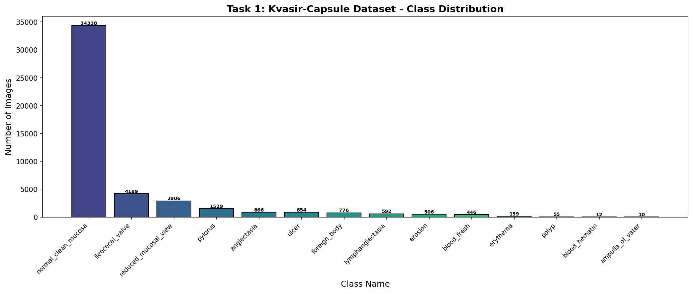
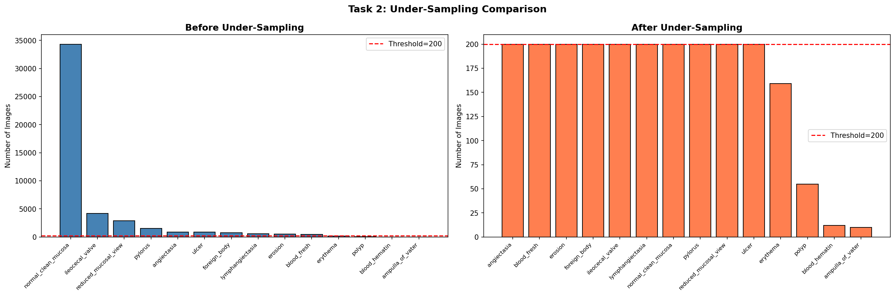
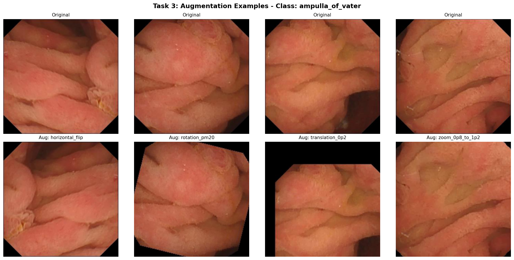
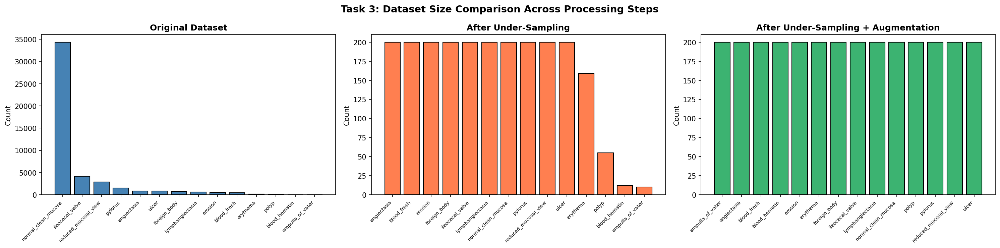
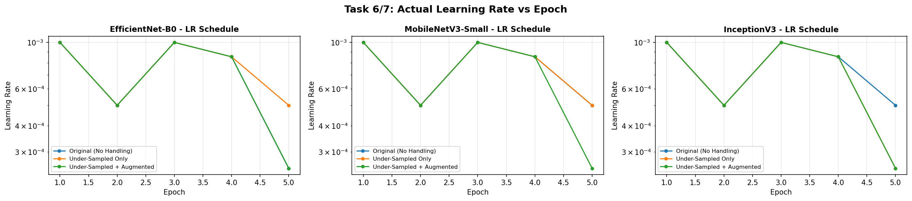
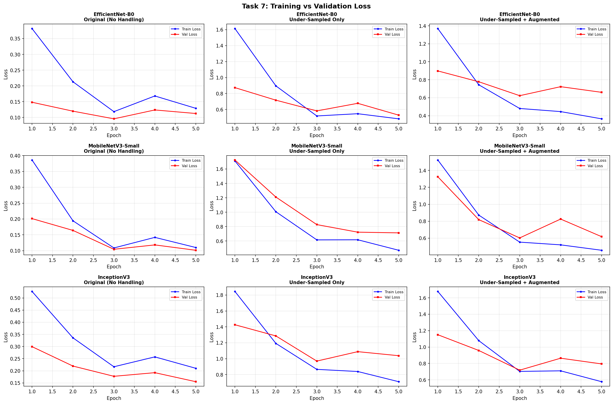
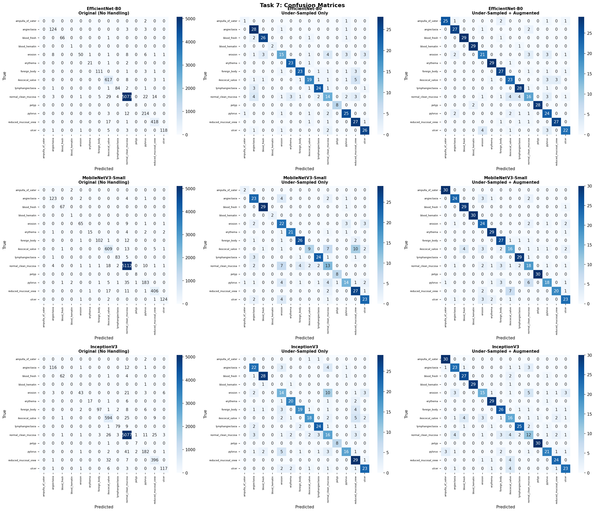
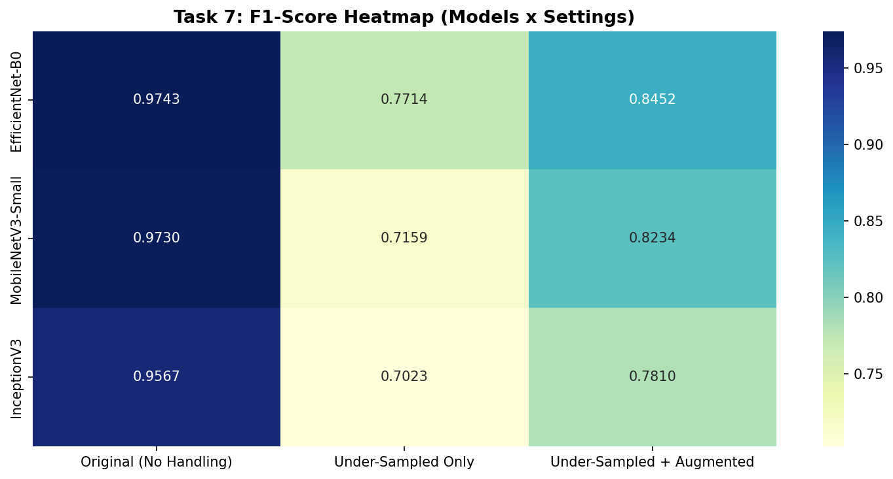
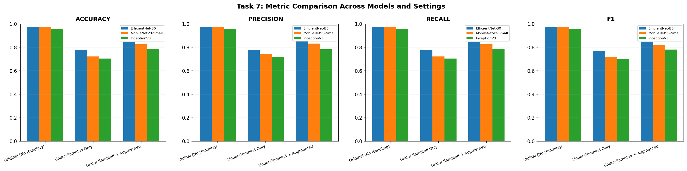

# Deep Learning–Based Classification of Imbalanced WCE Dataset (Minor Project Report)

**Student work artifact:** `WCE_Classification.ipynb`  
**Assignment brief:** `WCE_DL_Minor Project.pdf`  
**Date:** 2026-04-17  

## 1) Objective
Design, train, and evaluate deep learning models for gastrointestinal disease classification using an imbalanced Wireless Capsule Endoscopy (WCE) dataset, while applying:
- Under-sampling (majority class control)
- Augmentation-based over-sampling (minority class boosting)
- Transfer learning (freezing + fine-tuning)
- Intelligent learning-rate (LR) control

## 2) Dataset & Tools
- **Dataset:** Kvasir-Capsule (labeled images, imbalanced)
- **Total classes:** 14  
- **Total images:** 47,238
- **Framework:** PyTorch transfer learning (ImageNet-pretrained backbones)
- **Hardware used (as logged):** CUDA device

## 3) Task 1 — Dataset Exploration and Imbalance Analysis
### 3.1 Class distribution (original)
The dataset is heavily imbalanced:

| Class | Images |
|---|---:|
| normal_clean_mucosa | 34,338 |
| ileocecal_valve | 4,189 |
| reduced_mucosal_view | 2,906 |
| pylorus | 1,529 |
| angiectasia | 866 |
| ulcer | 854 |
| foreign_body | 776 |
| lymphangiectasia | 592 |
| erosion | 506 |
| blood_fresh | 446 |
| erythema | 159 |
| polyp | 55 |
| blood_hematin | 12 |
| ampulla_of_vater | 10 |

- **Median class size:** 684  
- **Imbalance ratio (max/min):** 3433.8× (34,338 vs 10)

**Why imbalance matters in medical diagnosis (short note):**  
If trained naively, the model can achieve high accuracy by over-predicting majority classes while failing on rare-but-critical findings. This is especially risky in medical screening, where minority classes may correspond to clinically important conditions. Therefore, handling imbalance is essential to improve recall/F1 on rare classes and reduce bias.

**Figure:** `task1_class_distribution.png`

## 4) Task 2 — Under-Sampling (Majority Class Control)
### 4.1 Approach
- Apply **safe under-sampling** to majority classes with a fixed threshold of **200 images/class**.
- Preserve all minority classes fully (no removal when counts are already low).

### 4.2 Outcome
- **Original total:** 47,238 images  
- **After under-sampling total:** 2,236 images  
- **Data loss:** 45,002 images (95.3%)

**Observation (data loss vs. balance):**  
Under-sampling strongly reduces majority dominance and mitigates bias, but it discards a large fraction of available training data. This can reduce overall performance if the remaining subset is too small or less diverse, so it is often paired with augmentation for minority classes.

**Figure:** `task2_undersampling.png`

## 5) Task 3 — Data Augmentation–Based Over-Sampling (Minority Classes)
### 5.1 Approach
Augmentation is applied **only to minority classes** until reaching the threshold (200 images/class). Techniques used include:
- Horizontal flip
- Rotation (±20°)
- Translation / shift (0.2)
- Zoom (0.8–1.2)
- Color jitter
- Gaussian blur
- Random erasing

### 5.2 Outcome
Minority classes are expanded up to the target threshold (200) while keeping original images.

**Figures:**
- `task3_augmentation_samples.png` (before/after sample images)
- `task3_dataset_comparison.png` (dataset size comparison)

## 6) Task 4 — Data Pre-Processing
- **Resize:** 224×224  
- **Normalization:** pixel values scaled/normalized (to match standard pretrained model pipelines)
- **Split:** 70% train, 15% validation, 15% test

Dataset split sizes (as logged):
- **Setting 1 — Original (No Handling):** Train 33,066 | Val 7,086 | Test 7,086
- **Setting 2 — Under-sampled only:** Train 1,565 | Val 335 | Test 336
- **Setting 3 — Under-sampled + augmented:** Train 1,960 | Val 420 | Test 420

## 7) Task 5 — Transfer Learning Model Design (3 Models)
Three ImageNet-pretrained models were evaluated:
- EfficientNet-B0
- MobileNetV3-Small
- InceptionV3

Transfer learning procedure:
- Load pretrained backbone
- Freeze early layers
- Replace final classification head for **14 classes**
- Apply regularization (dropout) and **L2 weight decay**

### 7.1 Trainable vs frozen parameters

| Model | Total Params | Trainable | Frozen | Trainable % |
|---|---:|---:|---:|---:|
| EfficientNet-B0 | 4,339,082 | 2,637,022 | 1,702,060 | 60.8% |
| MobileNetV3-Small | 1,078,318 | 740,654 | 337,664 | 68.7% |
| InceptionV3 | 22,313,710 | 11,649,742 | 10,663,968 | 52.2% |

## 8) Task 6 — Intelligent Learning Rate Control
An **intelligent hybrid LR controller** was implemented:
- **Cosine schedule** with warm-restart style cycling
- **Plateau-driven scaling** (multiplicative reduction if validation loss stalls)
- **Weight decay (L2)** in optimizer (`weight_decay = 1e-4`)

**Figures:**
- `task7_lr_actual.png` (learning rate vs epoch/steps)
- `task7_loss_curves.png` (training vs validation loss)

## 9) Task 7 — Training and Evaluation (3 Settings)
Each model was trained/evaluated under:
1. **Original (No Handling)**
2. **Under-Sampled Only**
3. **Under-Sampled + Augmented**

Metrics used: Accuracy, Precision, Recall, F1-score.

### 9.1 Comparison table (test-set results)

| Model | Setting | Accuracy | Precision | Recall | F1-Score |
|---|---|---:|---:|---:|---:|
| EfficientNet-B0 | Original (No Handling) | 0.974457 | 0.975079 | 0.974457 | 0.974251 |
| MobileNetV3-Small | Original (No Handling) | 0.973469 | 0.973401 | 0.973469 | 0.973015 |
| InceptionV3 | Original (No Handling) | 0.957804 | 0.957138 | 0.957804 | 0.956730 |
| EfficientNet-B0 | Under-Sampled Only | 0.776786 | 0.779478 | 0.776786 | 0.771429 |
| MobileNetV3-Small | Under-Sampled Only | 0.723214 | 0.743811 | 0.723214 | 0.715928 |
| InceptionV3 | Under-Sampled Only | 0.705357 | 0.721363 | 0.705357 | 0.702277 |
| EfficientNet-B0 | Under-Sampled + Augmented | 0.845238 | 0.850779 | 0.845238 | 0.845196 |
| MobileNetV3-Small | Under-Sampled + Augmented | 0.826190 | 0.832454 | 0.826190 | 0.823449 |
| InceptionV3 | Under-Sampled + Augmented | 0.785714 | 0.782701 | 0.785714 | 0.780959 |

### 9.2 Confusion matrices and per-class behavior
**Figures:**
- `task7_confusion_matrices.png`
- `task7_f1_heatmap.png`

### 9.3 Short analysis (8–10 lines)
Across the three backbones, the highest overall test scores are obtained in the **Original (No Handling)** setting, with **EfficientNet-B0** achieving the best accuracy and F1-score. However, this result can be influenced by the strong majority-class dominance in the dataset, so high accuracy does not necessarily imply good minority-class recognition. Under-sampling alone reduces performance substantially, mainly due to aggressive data reduction (only ~2.2k images kept), which limits diversity and generalization. When augmentation is added on top of under-sampling, performance improves for all models, indicating that minority boosting helps recover useful variation and stabilizes training. EfficientNet-B0 remains the best-performing model under imbalance-handling settings as well. MobileNetV3-Small provides competitive results with fewer parameters, making it attractive for resource-constrained deployment. InceptionV3 performs consistently lower than the other two in this setup. Overall, under-sampling + targeted augmentation provides a better balance between bias control and performance than under-sampling alone.

### 9.4 Best model (as logged)
- **Best model:** EfficientNet-B0  
- **Best setting:** Original (No Handling)  
- Accuracy: 0.9745, Precision: 0.9751, Recall: 0.9745, F1: 0.9743

**Figure:** `task7_metric_comparison.png`

## 10) How to Reproduce
- Open and run: `WCE_Classification.ipynb`
- Ensure dataset zip is present: `kvasir-capsule-labeled-images.zip`
- Outputs (plots) are saved in the project root (examples listed above) and results under `results\\`.
